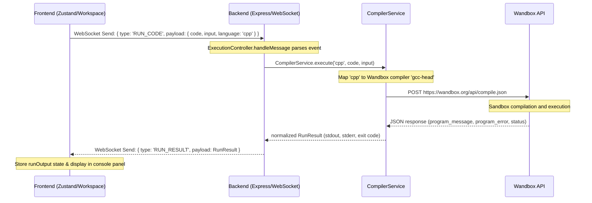
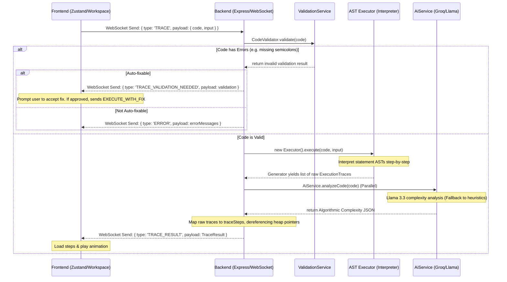

# C++ CodeFlow System Implementation Audit Report

This report provides a detailed analysis of the C++ execution, validation, visualization, and trace generation pipeline currently implemented in CodeFlow. This audit serves as the architectural blueprint for migrating and implementing the Python support system.

---

## 1. Project Architecture

The system is organized into a clean decoupled separation between a React frontend and an Express+WebSocket backend, with parallel execution and AI services.

```
CODE Visualizer/
├── frontend/                     # React + TS Frontend
│   └── src/
│       ├── components/           # Core layout components
│       ├── data/
│       │   └── problems/         # DSA Problem Storage System
│       ├── features/
│       │   └── visualizer/       # Code editor and canvas visualizers
│       │       └── components/
│       │           ├── visualizers/ # SVG & Framer-Motion renderers
│       │           └── panels/      # Left/Right visual panes (e.g. Whiteboard)
│       └── store/
│           └── executionStore.ts # Zustand state management
└── backend/                      # Node.js + TS Express Backend
    └── src/
        ├── controllers/
        │   └── execution.controller.ts # WebSocket handler
        ├── services/
        │   ├── compiler.service.ts     # Wandbox remote compiler (Real Run)
        │   ├── validation.service.ts   # AST-based validator & auto-fixer
        │   └── ai.service.ts           # Groq Llama-3.3 analysis
        ├── engine/
        │   └── languages/
        │       └── cpp/
        │           ├── parser.ts       # Custom Lexer/Parser for C++
        │           └── executor.ts     # Custom C++ AST-Interpreter (Trace Engine)
        └── server.ts                   # App entrypoint
```

### Module Roles & Dependencies
*   **Frontend**: Handles user editing (Monaco), controls playback (Zustand), and renders visualizations (Whiteboard SVG components).
*   **WebSocket Layer**: Provides real-time bidirectional communication between frontend and backend.
*   **Trace Engine (`parser.ts`, `executor.ts`)**: A custom-built C++ AST lexer, parser, and interpreter that executes C++ code deterministically line-by-line and collects stack, heap, and visual instructions at every step.
*   **Validation Service (`validation.service.ts`)**: Syntactically scans code using the custom parser and regex rules, detects pitfalls (infinite loops, missing headers), and creates auto-fix suggestions.
*   **Compiler Service (`compiler.service.ts`)**: Compiles and executes code using the external Wandbox API (`https://wandbox.org/api/compile.json`) to return real execution outputs (stdout, stderr, exit code).
*   **AI Service (`ai.service.ts`)**: Performs code analysis and complexity generation in parallel using Groq's Llama 3.3. Falls back to a TypeScript heuristic engine if the API key is absent.

---

## 2. Problem Storage System

All DSA problems are stored locally on the frontend in `frontend/src/data/problems/`.

### Directory Structure
Problems are categorized into subdirectories under `frontend/src/data/problems/`:
*   `arrays-hashing/`
*   `two-pointers/`
*   `sliding-window/`
*   `binary-search/`
*   `linked-list/`
*   `stack/`
*   `trees/`
*   `graphs/`
*   `heap/`
*   `dynamic-programming/`
*   `trie/`

The central registry is `frontend/src/data/problems/index.ts`, which uses Vite's `import.meta.glob` to eager-load all modules matching `./*/**/*.ts` and exports sorted arrays (`problemsList`) and maps (`problemsMap`).

### Data Structure (`ProblemDefinition`)
Defined in `frontend/src/data/problems/types.ts`, each problem is a TypeScript file exporting a default object of the following interface:

```typescript
export interface ProblemDefinition {
  id: string;                      // Unique problem slug (e.g., 'two-sum')
  title: string;                   // Human-readable title
  difficulty: 'Easy' | 'Medium' | 'Hard';
  category: string;                // Category matching registry ordering
  url: string;                     // LeetCode reference URL
  starterCode: string;             // Runnable source code containing a main() driver
  description?: string;            // Markdown description
  examples?: {                     // List of input-output test cases
    input: string;
    output: string;
    explanation?: string;
  }[];
  constraints?: string[];          // List of constraints
}
```

---

## 3. Code Editor Configuration

The frontend editor is loaded in `frontend/src/features/visualizer/components/CodeEditor.tsx`.

### Monaco Editor Integration
*   **Wrapper**: Uses `@monaco-editor/react`.
*   **Language Registration**: Leverages Monaco's built-in `cpp` language definition. Autocomplete, suggestions, and basic syntax highlighting are loaded automatically.
*   **Theme**: Set to standard `vs-dark` theme.
*   **State Binding**: Monaco is a controlled component bound to the Zustand store state:
    *   Loads value from `code` in `useExecutionStore`.
    *   Updates on modification: `onChange={(val) => setCode(val || '')}`.
    *   Becomes read-only during visual playback: `readOnly: traces.length > 0`.
*   **Decorations & Highlighting**:
    *   Reacts to changes in `currentStepIndex`.
    *   Computes visited lines (from step `0` to `currentStepIndex`) and highlights them in Monaco with `bg-primary/5 border-l-2 border-primary/20`.
    *   Identifies the currently executing line (`currentTrace?.line`) and highlights it with `bg-accent-cyan/25 border-l-4 border-accent-cyan`.
    *   Triggers center centering: `editorRef.current.revealLineInCenter(line)`.

---

## 4. Run Code Pipeline

The real code execution pipeline executes raw code with user inputs on a remote sandbox without generating traces.



---

## 5. Trace Generation Pipeline

The trace generation pipeline provides deterministic statement-by-statement execution tracking and algorithmic analysis.



### Trace Step State Tracking
At each execution step, the executor yields an `ExecutionTrace` object consisting of:
*   `line`: Line number executing.
*   `type`: Type of executing statement (`assignment`, `condition`, `loop_start`, etc.).
*   `stack`: Array of stack frames representing the active call stack:
    *   `function`: Function name.
    *   `locals`: Map of variable names to values in the local environment.
*   `heap`: Global heap mapping memory addresses (`#1000`) to complex objects (ListNode, TreeNode, Vector elements).
*   `output`: Combined stdout buffer up to this point.
*   `visuals`: Structured layout commands for canvas renderers.
*   `assignmentDetail`: Captures transitions between variables (source address/value and destination pointer/index) to drive fly-over canvas animations.

---

## 6. Visualization System

The canvas visualizers are SVG-based or HTML-based React components that receive a structured instruction object (`visuals`) and re-render reactively as `currentStepIndex` updates.

### Visualizer Elements

#### 1. Array 1D Visualizer (`ArrayVisualizer`)
*   **Input Schema**:
    ```typescript
    interface ArrayVisual {
        type: 'array_1d';
        target: string;                // Variable name
        values: any[];                 // Array elements
        pointers: PointerVisual[];     // Pointers (e.g., L, R, mid, i)
        highlightIndices?: number[];   // Indices active in current step
        swapIndices?: [number, number];// Indices swapped in current step
        windowRange?: [number, number];// Boundary indices of a sliding window
    }
    ```
*   **Renderer**: Renders horizontal blocks or vertical bars (for sorting). Maps cells to state styles (`traversing`, `comparing`, `swapping`, `sorted`, `pivot`, `found`). Colors pointers according to role (e.g. Left=red, Right=blue).

#### 2. Tree Visualizer (`TreeVisualizer`)
*   **Input Schema**:
    ```typescript
    interface TreeVisual {
        type: 'tree';
        nodes: { value: any; id: string; parentId?: string }[];
        currentNodeId?: string;
        activeNodes?: string[];
        visitedNodes?: string[];
        pointers?: { name: string; nodeId: string; color: string }[];
    }
    ```
*   **Renderer**: Dynamic tree coordinate calculation in SVG. Performs preorder/BFS layout calculation, rendering nodes as circles and connections as lines, highlighted by active/visited states.

#### 3. Graph Visualizer (`GraphVisualizer`)
*   **Input Schema**:
    ```typescript
    interface GraphVisual {
        type: 'graph';
        nodes: { id: string; value: any; label?: string }[];
        edges: { from: string; to: string; directed?: boolean; weight?: number }[];
        activeNodes?: string[];
        visitedNodes?: string[];
        activeEdges?: { from: string; to: string }[];
    }
    ```
*   **Renderer**: Calculates circular layout coordinates in SVG. Renders nodes as circles and edges as lines/curved vectors with arrows. Highlights active traversing edges (`u` and `v` matching).

#### 4. Stack & Queue Visualizer (`StackQueueVisualizer`)
*   **Input Schema**:
    ```typescript
    interface StackQueueVisual {
        type: 'stack' | 'queue' | 'deque';
        target: string;
        elements: any[];
        activeIndices?: number[];
    }
    ```
*   **Renderer**: CSS layouts simulating standard ADTs (vertical cup for stacks, horizontal double-ended tube for queues/deques). Animated using Framer Motion springs for entry and exit transitions.

#### 5. Priority Queue Visualizer (`PriorityQueueVisualizer`)
*   **Input Schema**:
    ```typescript
    interface HeapVisual {
        type: 'priority_queue';
        target: string;
        elements: any[];
        activeIndices?: number[];
        isMinHeap?: boolean;
    }
    ```
*   **Renderer**: Renders similarly to an array, marked with binary tree indices showing parent-child heap structures.

#### 6. Trie Visualizer (`TrieVisualizer`)
*   **Input Schema**:
    ```typescript
    interface TrieVisual {
        type: 'trie';
        target: string;
        nodes: { id: string; val: string; isWord: boolean; parentId?: string }[];
        pointers: { name: string; nodeId: string; color: string }[];
    }
    ```
*   **Renderer**: SVG tree hierarchy layout. The root is labeled `ROOT`, nodes display single character values, and leaf/words endpoints are visually highlighted.

#### 7. LinkedList Visualizer (`LinkedListVisualizer`)
*   **Input Schema**:
    ```typescript
    interface LinkedListVisual {
        type: 'linked_list';
        target: string;
        nodes: { id: string; value: any; next?: string | null; prev?: string | null }[];
        pointers: { name: string; nodeId: string; color: string }[];
        hasCycle?: boolean;
        cycleStartId?: string;
    }
    ```
*   **Renderer**: Sequential node layouts linked by directional arrows. Support for doubly linked list arrows (`prev` and `next`) and circular loopback curves if `hasCycle` is active.

#### 8. Recursion Visualizer (`CallStackVisualizer`)
*   **Input Schema**:
    ```typescript
    interface CallStackVisual {
        type: 'call_stack';
        frames: { functionName: string; args: Record<string, any> }[];
        activeFrame: number;
    }
    ```
*   **Renderer**: Renders recursive frames as stacked visual cards. Animates push/pop and highlights the arguments passed into recursive calls.

---

## 7. Complexity Engine

Algorithmic complexity analysis uses a hybrid architecture:

### 1. AI-Generated Complexity (Primary)
If `GROQ_API_KEY` is present, `aiService.analyzeCode(code)` sends a prompt to Groq model `llama-3.3-70b-versatile` asking for a structured JSON response matching:
*   `timeComplexity`, `spaceComplexity`, and `complexityExplanation`.
*   `timeBreakdown` and `spaceBreakdown` arrays (complexity of specific operations/structures).
*   `stepExplanations` listing derivation steps.
*   `detections` of code features.
*   `learningMode` comparison (Brute Force vs Optimized, transition steps, optimization reason).

### 2. Heuristic-Based Fallback (Offline/Fallback)
If Groq is offline or the key is missing, `heuristicAnalyze(code)` performs static code parsing:
*   **Containers**: Regex-based detection of C++ STL types (`vector`, `unordered_map`, `set`, etc.).
*   **Patterns**: Regex detection of pointers (`low`, `high`, `mid`) to infer Binary Search, Converging loops for Two Pointers, Window limits for Sliding Window.
*   **Nesting loops**: Analyzes brace matching indentation depth to estimate loops nesting levels (Nesting = 2 -> $O(N^2)$, Nesting = 3 -> $O(N^3)$).
*   **Recursion**: Checks if non-main functions make recursive self-calls (Halving/mid split -> $O(N \log N)$ Divide & Conquer vs simple decrement/increment -> $O(N)$ depth).
*   **Complexity Mapping**: Translates detected combinations into Big-O notation, complete with structured breakdowns and comparisons.

---

## 8. Trace Explanation Engine

Trace explanations are generated locally in a deterministic, template-based hybrid engine inside the C++ executor:

### 1. Step-Level Description
When executing statements, the interpreter passes a template-based description to `createTrace(..., explanation, vizContext)`:
*   Variable declaration: `Declared complement = 15`
*   Conditional test: `If condition: complement == nums[i]`
*   Outputs: `Printed: "Hello"` or `New line (endl)`

### 2. Substitutions and Calculations
If `vizContext.astNode` is passed to `createTrace`, the interpreter runs `getEvaluationDetail(node)` on the AST node, resolving identifiers to environment values and computing intermediate expressions.
*   It appends a calculation string: `(Calculation: target - nums[i] → 9 - 2 = 7)`.

### 3. State-Aware Explanations (Three-Part Explanation)
The explanation is divided into three pedagogical parts in `createTrace` and mapped in the UI:
*   **What** (`whatText`): The description with calculation details appended.
*   **Why** (`generateWhy(type, explanation)`): Rule-based explanation mapping:
    *   `condition` (true/false) -> `Condition is TRUE → taking the if-branch`.
    *   `loop_start` / `loop_continue` -> `Loop body runs — iteration X`.
    *   `loop_end` -> `Loop condition is false — loop exits`.
    *   `return` -> `Function returns X`.
*   **Next** (`generateNext(type)`): States what step executes next:
    *   `assignment` -> `Next statement executes.`.
    *   `condition` -> `Enter chosen branch.`.
    *   `loop` -> `Run loop body.`.
    *   `return` -> `Return to caller.`.

---

## 9. AI Integration Setup (Groq SDK)

The AI integrations are handled via `backend/src/services/ai.service.ts` using the official `groq-sdk` package.

### AI Properties
*   **Model**: `llama-3.3-70b-versatile` (selected as standard versatile model).
*   **Temperature**: `0.1` (low temperature ensures strict structure and deterministic JSON schema).
*   **Format**: Chat completions with JSON mode enabled when parsing data: `response_format: jsonMode ? { type: 'json_object' } : undefined`.

### Failures & Fallbacks
*   **API errors**: Handled inside try-catch blocks. If Groq rejects the request or times out, warning blocks are logged: `console.warn("AI Analysis Failed, using mock.")`, and the system silently falls back to offline heuristic mocks.
*   **JSON validation**: AI outputs are parsed via `JSON.parse`. If parsing fails, it falls back to heuristic maps.

---

## 10. Known Issues & Migration Recommendations

### C++ Constraints
1.  **Lexer/Parser limitations**: The custom parser cannot handle standard namespace scoping (`std::`), templates (`std::vector<int>`), structure pointers, classes, or nested types correctly. It bypasses this by flagging them as "advanced features" and executing what it can, but complex traces may look truncated.
2.  **Mocking API calls**: `generateTrace` is defined in `ai.service.ts` but never called. Real tracing is 100% deterministic inside `executor.ts`.

### Python Support Migration Plan
To build equivalent Python support, the Python engine must fit this exact architecture:
1.  **Monaco Editor**: Switch language key to `"python"` and add starter code templates.
2.  **Validation**: Implement a Python code validator (`python/validator.ts`) that checks syntax, infinite loops, and auto-fixes indentations or common syntax errors.
3.  **Trace Engine**: Create a Python trace executor (`engine/languages/python/executor.ts`) that implements `IExecutor`.
    *   Instead of writing a custom AST interpreter (which was necessary for C++ in Node), we should leverage Python's built-in parsing/tracing or compile Python to an AST using Node-based parsers, or run a Python subprocess executing `sys.settrace()` to serialize steps.
    *   The generated trace must format variables, locals, heap references, and structure pointer animations to match the exact JSON schemas expected by the frontend `WhiteboardPanel`.
4.  **Complexity & Flowcharts**: Adapt the Groq prompt templates in `ai.service.ts` to support Python syntax. Update `heuristicAnalyze` to support Python loop detection (e.g. `for i in range(...)` indentations).
