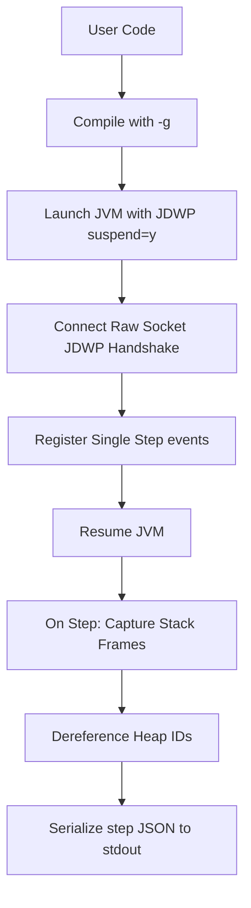

# CodeFlow Java Trace Architecture

This document specifies the trace architecture designed to capture step-by-step Java runtime changes, building on patterns from C++ and Python.

---

## 1. Trace Extraction Strategy Comparison

| Feature | C++ Engine | Python Engine | Java Engine |
|---|---|---|---|
| **Mechanism** | Code injection (injecting trace print statements before compilation) | `sys.settrace()` (Hooking python execution steps) | Java Debug Wire Protocol (JDWP) (Raw debugger socket) |
| **Granularity** | Statement / block level | Line level | Line / instruction level |
| **Overhead** | Medium (Recompilation of modified files) | Low (Pure interpreted inspection) | High (JVM debugging loop via socket) |

---

## 2. Java JDWP Tracing Pipeline

Java uses a debugger-driven approach:

### AST & Location Mapping
* Compilation with the `-g` flag attaches local variable tables and line numbers directly to the compiled bytecode class files.
* Single-stepping queries locations `(class_id, method_id, index)` to map execution steps directly back to lines of source code in the IDE.

### Variable Tracking
* For each line step, we request stack frames (`CMD_THREAD_FRAMES`).
* Using the method's `VARIABLE_TABLE`, we retrieve variables in scope.
* Primitive variables are read directly from stack values.
* Objects are queried through `CMD_OBJREF_GET_VALUES` or parsed via their fields recursively up to a certain depth.

### Heap and Reference Dereferencing
* Object fields and array values are referenced by `ObjectID` tags.
* The executor maps unique `ObjectID`s to a global heap dictionary (e.g. `"#12" -> { type: "Array", values: [...] }`).
* Frontend renderers parse heap reference mappings to display rich data structure visualizations.

### Loop and Block Tracking
* JDWP triggers step events on line number transitions.
* Loop conditions, variable updates, and array swaps emit incremental step states.
* Re-executing lines inside a `for` or `while` loop produces consecutive trace packets showing variable delta changes.
