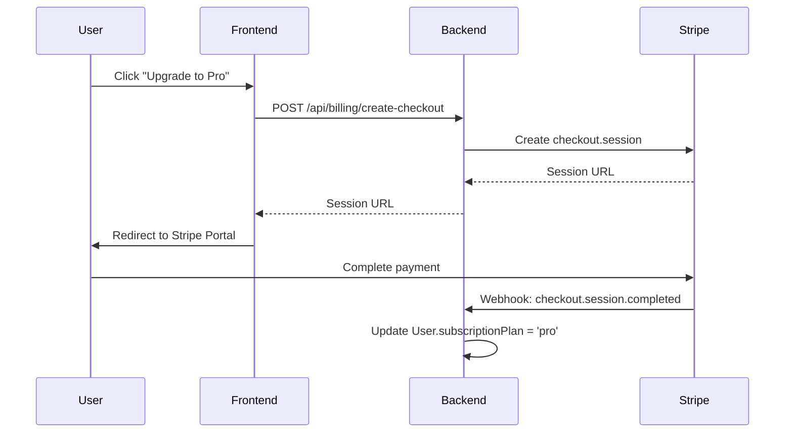

# CodeFlow Next Stage Growth & Billing Recommendations

This document outlines strategic recommendations for billing hook integration, marketing channels, and computation optimizations for the next development phase (Stage 4).

---

## 1. Stripe Billing Hooks Implementation

To activate the subscription system, you must bridge the current limits middleware with live Stripe checkout sessions.

### Critical Implementation Steps:
1. **Create Webhook Endpoint**:
   - File: `backend/src/routes/billing.routes.ts`
   - Endpoint: `POST /api/billing/webhook` (must use raw body parsing to verify Stripe signature).
2. **Handle Events**:
   - `checkout.session.completed`: Upgrade user's `subscriptionPlan` to `'pro'` or `'premium'`.
   - `customer.subscription.deleted`: Downgrade user to `'free'`.
   - `invoice.payment_failed`: Send notification mailer and flag account grace period.
3. **Stripe Billing Portal**:
   - Register route `/api/billing/portal` allowing Pro users to click "Manage Billing" and cancel or upgrade their plans.

---

## 2. Viral Marketing & Growth Channels

### Rich Social Media Previews
- **Goal**: When a user posts a shareable trace link (e.g. `codeflow.dev/share/abc123`) on X/Twitter or LinkedIn, the site must show a rich image preview instead of a text-only link.
- **Tactic**: Build a backend canvas renderer (`backend/src/services/og-renderer.service.ts`) that draws the visual state graph (e.g. trees, matrices) as a PNG. Use it in public problem pages and share paths as `<meta property="og:image" content="...">`.

### Structured Sitemap Generator
- **Goal**: Help Google and search crawlers automatically index all 198 problem pages.
- **Tactic**: Set up a weekly cron task in the backend that compiles `/sitemap.xml` listing every problem slug in `problemsMap`. Add `<link rel="canonical" ...>` headers to each SEO problem page to avoid duplicate search content penalty.

---

## 3. Computation & Resource Optimization

As user count grows, LLM token costs and VM execution times will scale. Implement these optimizations to maintain high margins:

### AI Review Cache
- Save prompt-completion results for AI Solution Reviews by hash matching the code string.
- If two users submit similar optimal answers for "Two Sum", serve the cached critique instead of hitting the Groq/OpenAI APIs.

### AST Node Sanitizer
- Prevent infinite loops or memory allocations from user scripts in C++ or Python execution sandboxes.
- Ensure CPU thread counts and execution durations are strictly capped (e.g. max 2 seconds per trace step-run).
