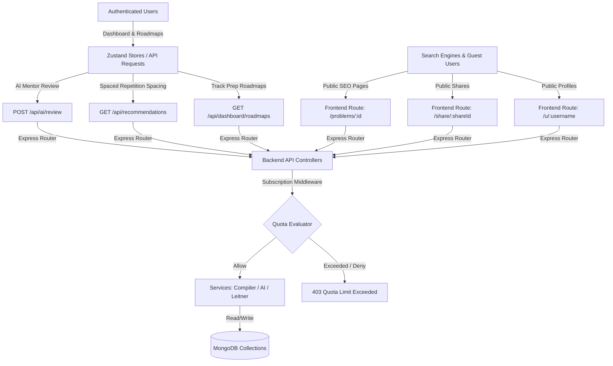

# CodeFlow Stage 3 Final Engineering Audit Report

This report provides a comprehensive architectural and engineering audit of all Phase 6 to Phase 10 features implemented in CodeFlow Stage 3. It serves as a detailed blueprint for any engineer joining the team to understand the growth, SEO, community engagement, and monetization foundations.

---

## 1. Architectural Summary of Stage 3

The goal of Stage 3 was to transition CodeFlow from a local, single-player Developer Tool into a multi-player, indexable, and monetizable startup platform. This was accomplished by building out public landing channels (SEO & Profiles), sharing mechanics (Trace Sharing), community & retention engines (Roadmaps, Weak Topics, Leitner Spaced Repetition, and AI Review), and a robust monetization foundation (Tiered Limits).

---

## 2. Component Audits (Phases 6–9)

### Phase 6: Weak Topic Detection & AI Target Practice
* **Purpose**: Keep users engaged by dynamically identifying subjects where they struggle (mastery < 40%) and proposing tailored problem challenges based on their Spaced Repetition (Leitner) queue.
* **Backend Implementation**:
  - **Controller**: `RecommendationController` ([recommendation.controller.ts](file:///c:/Users/asati/OneDrive/Documents/Padhai%20Stuff/Projects/CODE%20Visualizer/backend/src/controllers/recommendation.controller.ts))
  - **Route**: `GET /api/recommendations` registered in [dashboard.routes.ts](file:///c:/Users/asati/OneDrive/Documents/Padhai%20Stuff/Projects/CODE%20Visualizer/backend/src/routes/dashboard.routes.ts)
  - **Algorithm**:
    1. Scan user's `solvedProblems` map for lowest topic category mastery percentage under 70%.
    2. Scan user's active weak topics (mastery < 40%).
    3. Check user's Spaced Repetition Leitner queue inside `LearningProfile` for problems due or overdue for revision.
    4. Select a problem matching these criteria, or fall back to random unsolved/solved problems if the queue is empty.
* **Frontend Implementation**:
  - **Component**: `Dashboard.tsx` ([Dashboard.tsx](file:///c:/Users/asati/OneDrive/Documents/Padhai%20Stuff/Projects/CODE%20Visualizer/frontend/src/pages/Dashboard.tsx))
  - **Widget**: "AI Target Practice" card displaying the target problem category, difficulty, custom recommendation reason, and list of currently weak tags.

### Phase 7: Structured Prep Roadmap Engine
* **Purpose**: Guide users through structured interview preparation paths, giving them measurable metrics (readiness score, completion ratios) to make their progress trackable.
* **Tracks Defined**:
  1. **Beginner Core**: Foundations of arrays, strings, basic binary search.
  2. **FAANG Premium**: Classic top-tier problems.
  3. **Amazon Ultimate**: Amazon focus list.
  4. **Google Advanced**: Higher complexity graph, trie, and DP questions.
  5. **30-Day Blitz**: Curated list for immediate review.
  6. **60-Day Comprehensive**: Deep dive across all 18 topics.
* **Backend Implementation**:
  - **Controller**: `RoadmapController` ([roadmap.controller.ts](file:///c:/Users/asati/OneDrive/Documents/Padhai%20Stuff/Projects/CODE%20Visualizer/backend/src/controllers/roadmap.controller.ts))
  - **Route**: `GET /api/dashboard/roadmaps` registered in [dashboard.routes.ts](file:///c:/Users/asati/OneDrive/Documents/Padhai%20Stuff/Projects/CODE%20Visualizer/backend/src/routes/dashboard.routes.ts)
  - **Calculation**: Computes completion percentages by cross-referencing user solved problem IDs. Computes an estimated "readiness score" for the track based on difficulty-weighted solvings.
* **Frontend Implementation**:
  - **Component**: `LearningRoadmaps.tsx` ([LearningRoadmaps.tsx](file:///c:/Users/asati/OneDrive/Documents/Padhai%20Stuff/Projects/CODE%20Visualizer/frontend/src/pages/LearningRoadmaps.tsx))
  - **Navigation**: Registered route `/learning-roadmaps` in [App.tsx](file:///c:/Users/asati/OneDrive/Documents/Padhai%20Stuff/Projects/CODE%20Visualizer/frontend/src/App.tsx) and linked via [Navbar.tsx](file:///c:/Users/asati/OneDrive/Documents/Padhai%20Stuff/Projects/CODE%20Visualizer/frontend/src/components/Navbar.tsx).
  - **Interface**: Left-side roadmap selector cards; right-side interactive SVG/flex node paths where each problem node displays current state (locked, unlocked, solved) and routes directly to the workspace.

### Phase 8: AI Mentor Solutions Review
* **Purpose**: Let users request automated, deep complexity critiques of their code directly from the workspace without spoiling optimal solutions or leaking answer keys.
* **Backend Implementation**:
  - **Service**: `AiService` ([ai.service.ts](file:///c:/Users/asati/OneDrive/Documents/Padhai%20Stuff/Projects/CODE%20Visualizer/backend/src/services/ai.service.ts)) using Groq (`llama-3.3-70b-versatile`).
  - **Route**: `POST /api/ai/review` registered in [ai.routes.ts](file:///c:/Users/asati/OneDrive/Documents/Padhai%20Stuff/Projects/CODE%20Visualizer/backend/src/routes/ai.routes.ts).
  - **Prompt Protection**: Uses strict formatting system instructions forcing the AI to evaluate readability, time and space complexity, and code quality, while explicitly forbidding it from printing or leaking the target solution or refactored code.
* **Frontend Implementation**:
  - **Component**: `AiTutorWidget.tsx` ([AiTutorWidget.tsx](file:///c:/Users/asati/OneDrive/Documents/Padhai%20Stuff/Projects/CODE%20Visualizer/frontend/src/features/workspace/components/AiTutorWidget.tsx)).
  - **Trigger**: A designated review sparkle chip triggering code submission. Renders the AI response in a structured markdown block in the workspace panel.

### Phase 9: Tiered Subscription Limits
* **Purpose**: Establish monetization hooks by limiting high-compute executions (trace generations) and AI-advisor invocations based on subscription tiers (Free, Pro, Premium).
* **Database Models**:
  - **User**: `subscriptionPlan: 'free' | 'pro' | 'premium'` added to [User.ts](file:///c:/Users/asati/OneDrive/Documents/Padhai%20Stuff/Projects/CODE%20Visualizer/backend/src/models/User.ts).
  - **DailyProgress**: `aiRequestsCount` added to [DailyProgress.ts](file:///c:/Users/asati/OneDrive/Documents/Padhai%20Stuff/Projects/CODE%20Visualizer/backend/src/models/DailyProgress.ts).
* **Enforcement Middleware**:
  - **HTTP Interceptor**: `checkSubscriptionLimits` ([subscription.ts](file:///c:/Users/asati/OneDrive/Documents/Padhai%20Stuff/Projects/CODE%20Visualizer/backend/src/middleware/subscription.ts)) intercepts `POST /api/ai/tutor` and `POST /api/ai/review`.
  - **WebSocket Interceptor**: `execution.controller.ts` ([execution.controller.ts](file:///c:/Users/asati/OneDrive/Documents/Padhai%20Stuff/Projects/CODE%20Visualizer/backend/src/controllers/execution.controller.ts)) intercepts trace generation steps.
* **Quotas Enforced**:
  - **Free**: 5 AI requests/day, 10 code-to-trace compilations/day.
  - **Pro**: 50 AI requests/day, 100 code-to-trace compilations/day.
  - **Premium**: Unlimited access.

---

## 3. Verification & Build Suite

All tests compile, and builds run cleanly:
1. **Frontend Compilation**: Built successfully (`npm run build`).
2. **Backend Compilation**: Compiled successfully (`npm run build`).
3. **Stage 3 Unit & Integration Tests**: All passed (`npm run test:stage3`).
4. **Learning Foundation Tests**: All passed (`npm run test:learning`).
5. **C++ Problems Sheet Coverage**: 198/198 problems compiled and verified successfully.
6. **Python Problems Sheet Coverage**: 198/198 problems compiled and verified successfully.
